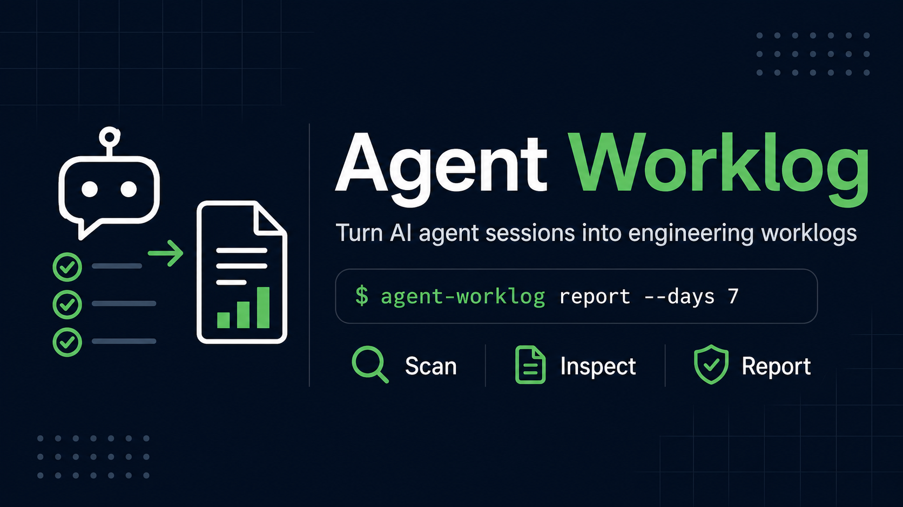

# Agent Worklog

Agent Worklog turns coding-agent sessions into weekly engineering reports. It saves
engineers time and makes it easier to share progress with managers.



## Capabilities

Agent Worklog currently works with OpenCode and can:

- Find OpenCode sessions across all projects, no matter which folder you are in.
- Select sessions from recent days, a calendar week, or a specific date range.
- Export sessions with `opencode export --sanitize`.
- Group Git worktrees that belong to the same repository.
- Keep child sessions linked to the correct repository.
- Leave out subagent sessions with `--root-only` when you only want root sessions.
- List each repository's session titles and working folders in the report.
- Summarize models, tokens, and tools from `opencode stats`.
- Include source activity IDs and confidence levels as supporting information.
- Remove common secrets before creating a report or sending data to an optional LLM.
- Continue when one session cannot be exported and add a warning to the report.
- Write Markdown reports safely with permissions that allow only the owner to read
  them.

## Requirements

- Python 3.11 or newer
- OpenCode available as `opencode`
- An OpenCode version that provides `opencode db` and `opencode export --sanitize`
- Git available as `git`

## Installation

The recommended way to install the command-line tool is with `pipx`:

```bash
pipx install agent-worklog
```

You can also install it in a regular Python environment:

```bash
pip install agent-worklog
```

For development:

```bash
git clone https://github.com/mike840609/agent-worklog.git
cd agent-worklog
uv sync --locked --extra dev
```

## Getting started

Check that OpenCode and Git are available:

```bash
agent-worklog doctor
```

Preview how Agent Worklog groups repositories for the previous full week:

```bash
agent-worklog scan --period last-week
```

Create the Markdown report without using an external LLM:

```bash
agent-worklog report --period last-week --no-llm
```

The default output is written under `reports/`.

## Reporting periods

The `last-week` period means the previous full calendar week in the configured time
zone. It starts on Monday at 00:00 and ends just before the next Monday at 00:00.

```bash
agent-worklog report --period last-week
```

Use `--days` to report activity from a number of recent days:

```bash
agent-worklog report --days 7
```

Use ISO timestamps to set exact start and end times:

```bash
agent-worklog report \
  --since 2026-07-20T00:00:00+08:00 \
  --until 2026-07-27T00:00:00+08:00
```

You must provide one of `--period`, `--days`, or `--since`. If you use `--until`, you
must also use `--since`.

## Subagent sessions

Subagent sessions are included by default. Each one is linked to the repository it actually
ran in, so a subagent that worked in another checkout appears under that repository. To
report only root sessions:

```bash
agent-worklog report --period last-week --root-only
```

## Repository grouping

Agent Worklog checks each session separately to decide which repository it belongs to.
It uses the following information in order:

1. The Git `origin` remote.
2. A protected ID based on the shared Git directory.
3. The OpenCode project ID.
4. A protected ID based on the working directory.
5. A separate unknown ID for the session.

SSH and HTTPS addresses for the same repository are treated as the same repository.
Different branches are also grouped together. If a child session works in another
repository, it stays linked to that repository.

## LLM summaries

LLM summaries are optional. Agent Worklog connects to an OpenAI-compatible service only
when all of the following are true:

- LLM support is turned on.
- `--no-llm` is not used.
- The API key is set in the selected environment variable.

For the default OpenAI-compatible configuration:

```bash
export OPENAI_API_KEY="..."
agent-worklog report --period last-week
```

The request contains organized information with secrets removed. It does not contain
raw transcripts or raw session details. If the service times out, returns an HTTP 429
or 5xx error, or returns invalid data, Agent Worklog tries once more. If the second
request fails, it creates a summary without the LLM. Use `--no-llm` to keep report
generation on your computer.

## Usage statistics

Each report includes a usage section built from `opencode stats`, covering models, tokens,
and tools. OpenCode reports usage only for a period that ends now. The period shown in the
report therefore starts when the report period starts and runs to the time the report is
created. It covers the report period but is wider than it. If `opencode stats` is not
available, Agent Worklog leaves the section out and adds a warning to the report.

## Output and file handling

Set the output file with `--output`:

```bash
agent-worklog report \
  --period last-week \
  --no-llm \
  --output weekly.md
```

Agent Worklog does not replace an existing file unless you use `--force`:

```bash
agent-worklog report --period last-week --output weekly.md --force
```

Use `--dry-run` to preview the Markdown without writing a file:

```bash
agent-worklog report --period last-week --no-llm --dry-run
```

Use `--verbose` to show export and LLM fallback warnings. Use `--quiet` to show only the
output path after a successful report.

## Configuration

Agent Worklog uses environment variables for its settings. Variable names start with
`AGENT_WORKLOG_`. Use `__` between parts of a setting name. For example:

```bash
export AGENT_WORKLOG_REPORT__TIMEZONE="Asia/Taipei"
export AGENT_WORKLOG_REPORT__OUTPUT_DIRECTORY="reports"
export AGENT_WORKLOG_HARNESSES__OPENCODE__CLI__EXECUTABLE="opencode"
export AGENT_WORKLOG_LLM__MODEL="gpt-5-mini"
export AGENT_WORKLOG_LLM__BASE_URL="https://api.openai.com/v1/"
export AGENT_WORKLOG_LLM__ENABLED="false"
```

See [Configuration](docs/configuration.md) for a complete list of settings.

## Privacy

Agent Worklog requests OpenCode exports with `--sanitize`. It also removes common
secrets from all parts of the data before creating a report or making an optional LLM
request.

Reports may still contain private goals, filenames, commands, and work descriptions.
Always review a report before sharing it.

See [Privacy and security](docs/privacy.md) for more details about data safety and
current limits.

## Failure handling and exit codes

If one session cannot be exported, Agent Worklog skips it and adds a warning to the
report. If no sessions can be exported, the command stops with an error instead of
creating an empty report.

| Code | Meaning |
|---:|---|
| 0 | Success |
| 2 | Invalid command options |
| 3 | Settings error |
| 4 | No matching activity |
| 5 | OpenCode error |
| 7 | Report file error |

## Current support and limits

- OpenCode is the only supported coding-agent tool.
- Agent Worklog gets session data through the OpenCode command-line tool. It does not
  read the SQLite database directly.
- Markdown is the only report format.
- Usage statistics cover a period that ends when the report is created. They do not match
  the report period exactly.
- Agent Worklog does not keep a cache between runs and does not provide an `inspect`
  command.
- Older sessions may use a backup ID if their working folders have been deleted.
- Repository grouping uses the Git information available when the report is created.
- Codex and Claude Code are not currently supported.

## Development checks

```bash
uv sync --locked --extra dev
uv run pytest --cov=agent_worklog --cov-fail-under=80
uv run ruff check .
uv run pyright
uv build
```

See [Releasing Agent Worklog](docs/releasing.md) for release instructions.

## License

MIT
